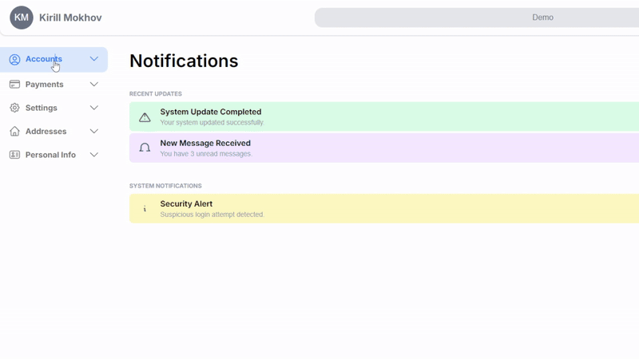

# Multi-level Sidebar 

## Sidebar navigation using React Typescript

---------
## Features

Renders a responsive two-column layout with a sticky sidebar and dynamic content area.

The sidebar contains collapsible sections, each with animated expand/collapse interactions.

Clicking a menu item reveals the corresponding settings panel in the main content area.

Smooth open/close animations powered by Framer Motion and AnimatePresence.

Built with TypeScript and Tailwind CSS for scalability, responsiveness, and rapid styling.

## How it works 

useState manages which section is expanded, and which settings panel is currently selected.

On click, the selected section is updated and the relevant component (<General />, <Security />, etc.) is displayed.
